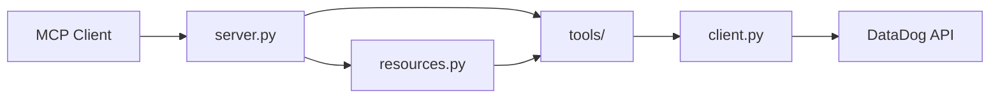

# DataDog MCP architecture

The DataDog MCP server is a [FastMCP](https://modelcontextprotocol.github.io/python-sdk/) application that exposes DataDog via **tools**, **resources**, and **prompts**. It uses the official [datadog-api-client](https://github.com/DataDog/datadog-api-client-python) and loads configuration from the environment.

## Components

- **server.py** — FastMCP app: registers all tools, resources, and prompts; default transport is stdio (optionally streamable HTTP for MCP Inspector).
- **config.py** — Reads `DD_API_KEY`, `DD_APP_KEY`, and `DD_SITE` from the environment; raises a clear error if required keys are missing.
- **client.py** — Builds a shared `ApiClient` (and validates keys on first use) used by all tool modules.
- **tools/** — One module per domain (monitors, dashboards, metrics, logs, events, hosts, slos, incidents, apm, usage, downtimes). Each tool returns JSON strings; on API errors they return `{"error": "..."}` via **errors.sanitize_error** (no secrets or raw stack traces).
- **resources.py** — Thin wrappers for URI-addressable resources (`datadog://monitors`, `datadog://dashboards`, etc.); they call the same tool logic so data stays live and consistent.

## Flow

- User or MCP client invokes a tool, resource, or prompt.
- The server dispatches to the corresponding tool implementation (or resource wrapper that uses tools).
- Tool code uses the shared API client to call the DataDog API; errors are sanitized and returned as JSON.

## Error handling

- All API failures are caught and turned into a safe user-facing message via **errors.sanitize_error** (no logging or returning of API keys or stack traces). Tool responses use a consistent shape: success returns domain JSON; failure returns `{"error": "..."}`.
- On 429 (rate limit), the server retries with backoff (see tool_reference.md); if still rate-limited, it returns a sanitized error.

## Secrets

Credentials are read only from the environment (or a `.env` file used by the runner). They are never logged, echoed, or committed. See README and CONTRIBUTING.
